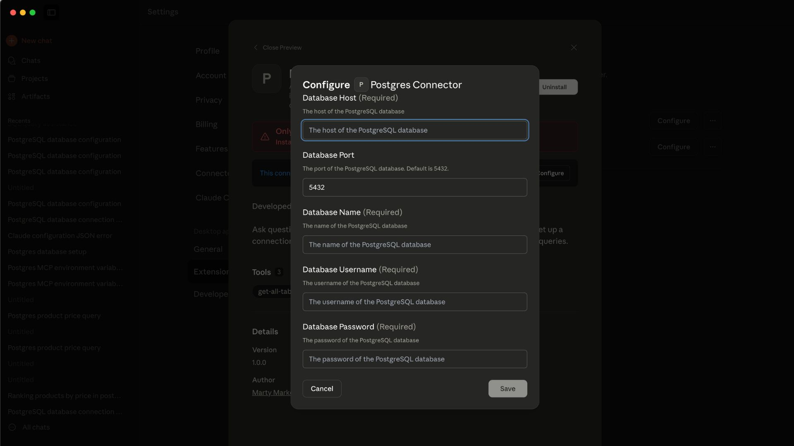
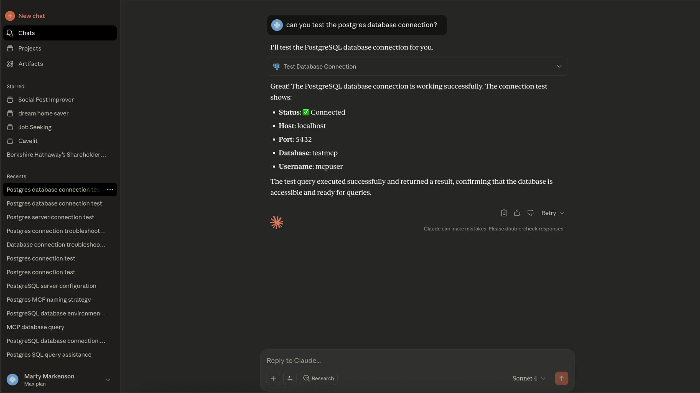

# PostgreSQL MCP Server


An MCP (Model Context Protocol) server for querying a PostgreSQL database. Execute SQL queries, view table details, and manage database connections through MCP-compatible clients.

## Key Features

- **Database Connection**: Connect to PostgreSQL databases with authentication
- **SQL Execution**: Execute SELECT queries with security validation
- **Connection Testing**: Test database connection status

## Installation

### Claude Desktop
Follow these steps for installation:

#### Step 1: Download the MCP Server
Download the `postgres-connector.mcpb` file from this repository (located in the root directory).

#### Step 2: Install the MCP Server
1. Open Claude Desktop
2. Navigate to **Settings** > **Features**
3. Click **"Install Extension"** and select the `postgres-connector.mcpb` file


*Screenshot placeholder: Installing the .mcpb file*

#### Step 3: Configure Database Connection
After installation, the PostgreSQL Connector will appear in your Claude Desktop with default environment variables that you can configure with your database details.


*Screenshot placeholder: Database configuration interface showing environment variables*

#### Step 4: Test the database connection
Send a query "test the database connection"


## Configuration

### Required Database Settings

You'll need to provide the following information for your PostgreSQL database:

| Environment Variable | Description | Required | Default |
|---------------------|-------------|----------|---------|
| **POSTGRES_HOST** | The hostname or IP address of your PostgreSQL server | ✅ Yes | - |
| **POSTGRES_PORT** | The port number for your PostgreSQL server | ❌ No | 5432 |
| **POSTGRES_DB** | The name of the specific database to connect to | ✅ Yes | - |
| **POSTGRES_USER** | Your PostgreSQL username | ✅ Yes | - |
| **POSTGRES_PASSWORD** | Your PostgreSQL password | ✅ Yes | - |

These environment variables will be automatically available for configuration in the extension settings panel after installing the extension in Claude Desktop.

## Available Tools

### 1. Test PostgreSQL Connection
**Tool**: `test-postgres-connection`

Tests your database connection and displays the current configuration (password hidden for security).

**Example Output**:
```
✅ Database connection successful!

Configuration:
{
  "host": "localhost",
  "port": "5432",
  "database": "myapp_production",
  "username": "postgres",
  "password": "***hidden***"
}

Connection test result: [
  {
    "test": 1
  }
]
```

### 2. Get All Tables
**Tool**: `get-all-tables`

Retrieves a list of all tables in the public schema of your database.

**Example Output**:
```json
[
  {
    "table_name": "users"
  },
  {
    "table_name": "orders"
  },
  {
    "table_name": "products"
  },
  {
    "table_name": "categories"
  }
]
```

### 3. Execute SQL Query
**Tool**: `execute-sql-query`

Executes SELECT queries on your database with security validation.

**Input**:
- `sql`: The SQL query to execute (SELECT statements only)

**Example Usage**:
```sql
SELECT id, name, email FROM users LIMIT 5;
```

**Example Output**:
```json
[
  {
    "id": 1,
    "name": "John Doe",
    "email": "john@example.com"
  },
  {
    "id": 2,
    "name": "Jane Smith",
    "email": "jane@example.com"
  }
]
```

## Security & Safety

### SQL Query Validation
The PostgreSQL MCP server includes security measures:

- **READ-ONLY Operations**: Only SELECT statements are permitted
- **Dangerous Keywords Blocked**: DROP, DELETE, TRUNCATE, ALTER, CREATE, INSERT, UPDATE operations are automatically blocked
- **Statement-Level Validation**: Each SQL statement is validated individually
- **Safe Error Handling**: Database errors are caught and displayed safely

Best practice is to create a read-only database user for the postgres connector to use.

### Blocked Operations
The following SQL operations are **NOT ALLOWED** for security:
- `DROP` (deleting tables/databases)
- `DELETE` (removing data)
- `TRUNCATE` (clearing tables)
- `ALTER` (modifying structure)
- `CREATE` (creating new objects)
- `INSERT` (adding data)
- `UPDATE` (modifying data)

## Usage Examples

### Get Database Tables
Use the `get-all-tables` tool to retrieve all tables in your database schema.

### Execute Queries
Use the `execute-sql-query` tool with SELECT statements:
```sql
SELECT * FROM users LIMIT 10;
```

## Troubleshooting

### Connection Issues

**Problem**: "Database connection failed"
- **Check**: Verify your host, port, database name, username, and password
- **Check**: Ensure your PostgreSQL server is running and accessible
- **Check**: Verify that your database user has the necessary permissions

**Problem**: "Connection timeout"
- **Check**: Your database server might be behind a firewall
- **Check**: The host address and port number are correct
- **Check**: Network connectivity to the database server

### Query Issues

**Problem**: "Dangerous operation detected"
- **Cause**: You're trying to execute a non-SELECT statement
- **Solution**: Only SELECT queries are allowed for security reasons

**Problem**: "Query execution failed"
- **Check**: Your SQL syntax is correct
- **Check**: The tables and columns you're referencing exist
- **Check**: Your database user has SELECT permissions on the tables

### Configuration Issues

**Problem**: MCP server not appearing in Claude Desktop client
- **Solution**: Restart Claude Desktop
- **Check**: Verify the .mcpb file was installed correctly
- **Check**: Look for any error messages in Claude Desktop's console

**Problem**: Environment variables not showing up
- **Solution**: Restart Claude Desktop after installation
- **Check**: Ensure the extension is enabled in Settings > Features

**Problem**: Cannot configure database settings
- **Solution**: Make sure all required environment variables are filled out
- **Check**: Verify your database credentials are correct

## Technical Details

### System Requirements
- PostgreSQL database (version 9.0 or higher)
- Network access to your PostgreSQL server

### Dependencies
- Node.js runtime
- PostgreSQL client libraries
- MCP (Model Context Protocol) framework

### Project Structure
```
postgres-connector/
├── src/
│   └── server.ts          # Main MCP server implementation
├── package.json           # Node.js dependencies
├── manifest.json          # MCP extension manifest
├── icon.png              # Extension icon
└── postgres-connector.mcpb # Compiled extension bundle
```

## License

MIT License - see the LICENSE file for details.

## Author

**Marty Markenson**
- Email: martyamark@gmail.com
- LinkedIn: [Marty Markenson](https://www.linkedin.com/in/marty-markenson-08b79058/)

---

**Need help?** Open an issue in this repository or reach out to martymarkenson